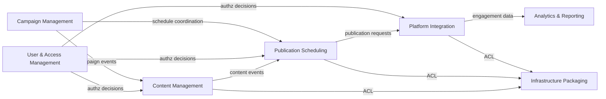

**Purpose:** Visualize dependencies and translation boundaries.

**Contents**
- [Map](#map)
- [Notes](#notes)
- [Sources](#sources)

### Map

### Notes
- **Content Management** → **Publication Scheduling**: Publisher/Consumer relationship via domain events
- **Publication Scheduling** → **Platform Integration**: Command/Response pattern for API calls  
- **Analytics & Reporting**: Shared Kernel for cross-context reporting
- **User & Access Management**: Shared Kernel providing security context to all bounded contexts
- **Infrastructure Packaging**: Acts as Anti-Corruption Layer between Postiz domain and our container orchestration

### Sources
- "Postiz Context Integration" — https://docs.postiz.com/architecture/context-integration — retrieved 2025-01-09

<!-- ai-docs-metadata
{"last_audit":"2025-01-09","fingerprints":{"sources":{"https://docs.postiz.com/architecture/context-integration":"sha256:pending"},"sections":{"context-map":"sha256:v7w8x9y0"}}}
-->